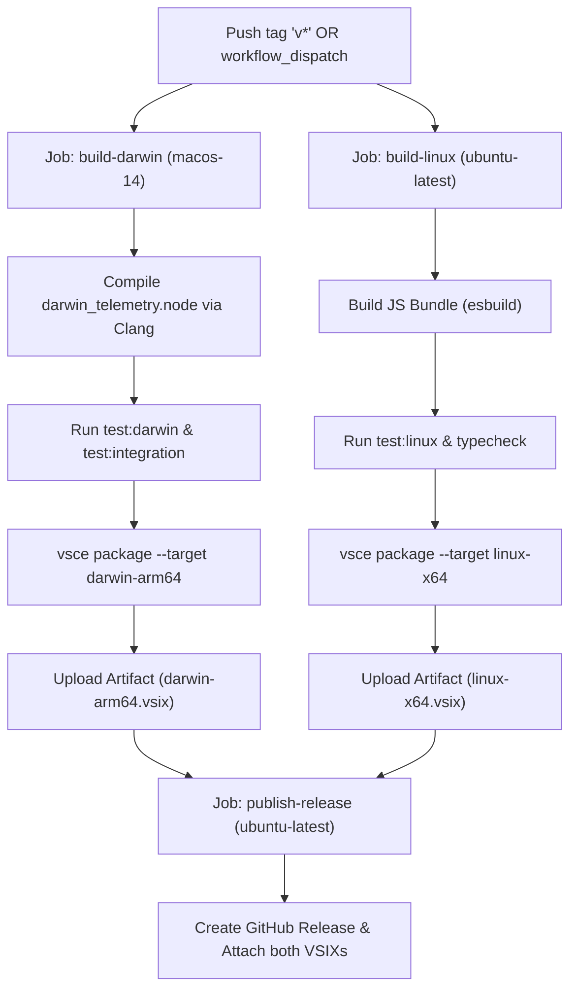

# Linux v1.1.0 Implementation Plan: Architectural Parity & Release Pipeline

This document establishes the formal engineering specification and execution roadmap for bringing **Linux (`linux-x64`)** support in **Resource Monitor NG** to complete feature, visual, and performance parity with **v1.1.0** on macOS Apple Silicon (`darwin-arm64`).

---

## 1. Scope & Architectural Goals

The goal of this phase is to align the Linux implementation with the architectural advancements introduced in v1.1.0:
1. **100% Monospace ASCII Table Uniformity**: Replace the legacy Markdown bulleted list for CPU clock frequencies with deterministic monospace ASCII tables.
2. **Cold-Start (Tick 0) Synchronization**: Eliminate the initial 0.0% empty hover state on Linux by pre-sampling `/proc/stat` during provider initialization.
3. **Battery Telemetry Expansion**: Parse available sysfs nodes (`power_now`, `current_now`, `time_to_empty_now`, `time_to_full_now`) to compute accurate time remaining.
4. **Hardware Thermal Accuracy**: Dynamically detect critical and maximum temperature thresholds (`temp*_crit`, `temp*_max`) from `/sys/class/hwmon/`.
5. **Standalone Linux Test Suite**: Provide an automated smoke test (`test/smoke-linux.mjs`) runnable locally on physical/virtual Linux machines and in GitHub Actions.
6. **Cross-Platform Dual-Runner CI/CD**: Ristructure GitHub Actions into a decoupled multi-runner matrix (`macos-14` for Darwin native build, `ubuntu-latest` for Linux build) with `workflow_dispatch` manual triggering and dual `.vsix` asset release.

---

## 2. Technical Gap Analysis & Proposed Solutions

### 2.1. CPU Frequency Monospace Table Layout
* **Current State**: In [`src/extension.ts`](../src/extension.ts#L551-L574), when `freqOrLoad.kind === 'freq'` (Linux), the core speeds are emitted as a plain Markdown bullet list (`- **Core 0**: 3.20 GHz`). On high-core count machines (16, 32, 64 cores), this causes catastrophic vertical expansion of the tooltip.
* **Proposed Design**:
  * Utilize [`renderDynamicAsciiTable`](../src/extension.ts#L182-L225) or a dual-cluster layout matching the CPU utilization table:
    * For $\ge 4$ cores: Split into two columns (`Cluster 0` / `Cluster 1` or `Cores 0-N` / `Cores N-M`) with format:
      ```text
      Cluster 0 (C0 - C3)     │ Cluster 1 (C4 - C7)    
      ────────────────────────┼────────────────────────
      C0: [██████] 4.80 GHz   │ C4: [████░░] 3.20 GHz  
      C1: [██████] 4.80 GHz   │ C5: [████░░] 3.20 GHz  
      C2: [████░░] 3.60 GHz   │ C6: [██░░░░] 1.80 GHz  
      C3: [████░░] 3.60 GHz   │ C7: [██░░░░] 1.80 GHz  
      ```
    * Include aggregate summary rows:
      ```text
      Metric       │ Clock Speed │ Relative Scale
      ─────────────┼─────────────┼───────────────────
      Average Core │ 3.75 GHz    │ [█████░] 78.1%   
      Peak Core    │ 4.80 GHz    │ [██████] 100.0%  
      ```
  * Maintain user-configurable unit conversion (`GHz`, `MHz`, `KHz`, `Hz`).

### 2.2. CPU Cold-Start (Tick 0) Synchronization
* **Current State**: [`CpuProvider`](../src/platform/linux/cpu.ts#L24-L35) starts with `prevOverall = null` and empty `prevCores`. The first call to `sample()` returns `overallPercent = 0` and all `perCorePercent = 0`.
* **Proposed Design**:
  * Execute a baseline parse of `/proc/stat` in the `constructor()` of [`CpuProvider`](../src/platform/linux/cpu.ts#L24):
    ```typescript
    constructor() {
      // Prime baseline tick counters immediately to eliminate Tick 0 empty state
      this.sample();
    }
    ```
  * Ensure that if `sample()` is called again shortly after (e.g. initial hover), it calculates non-zero deltas if jiffies advanced, or displays the correct core count and topological structure instead of an empty array.

### 2.3. Battery Autonomy & Time Remaining
* **Current State**: [`BatteryProvider`](../src/platform/linux/battery.ts#L193-L209) extracts `currentCapacity`, `maxCapacity`, `designCapacity`, `healthPercent`, and `cycleCount`, but omits `timeRemainingMinutes`.
* **Proposed Design**:
  * In `discoverBatteries()`, inspect the battery sysfs directory for:
    * `time_to_empty_now` (seconds until discharge; available on ACPI SBS batteries).
    * `time_to_full_now` (seconds until full charge).
    * `power_now` (instantaneous power draw in µW) or `current_now` (current in µA).
  * In `sample()`, derive remaining minutes:
    * If `time_to_empty_now` exists: `timeRemainingMinutes = Math.round(timeToEmptySec / 60)`.
    * If discharging and `power_now > 0` with `energy_now`:
      $$\text{Minutes} = \text{round}\left(\frac{\text{energy\_now}}{\text{power\_now}} \times 60\right)$$
    * If discharging and `current_now > 0` with `charge_now`:
      $$\text{Minutes} = \text{round}\left(\frac{\text{charge\_now}}{\text{current\_now}} \times 60\right)$$
    * Analogous calculations for charging state with `energy_full - energy_now`.

### 2.4. Thermal Trip Point Discovery (`hwmon`)
* **Current State**: In [`src/extension.ts`](../src/extension.ts#L630-L637), the thermal limit column is hardcoded to `'100 °C'`.
* **Proposed Design**:
  * In [`CpuTempProvider`](../src/platform/linux/cputemp.ts#L103-L136), check for `temp1_crit` or `temp1_max` adjacent to `temp1_input`.
  * If found, expose `critCelsius` in `CpuTempInfo` (e.g. 95 °C for AMD Ryzen, 105 °C for Intel Core).
  * Pass this dynamic value to the `renderDynamicAsciiTable` Limit column, falling back to 100 °C if no trip point is defined in kernel sysfs.

---

## 3. Dedicated Linux Smoke Test Suite (`test/smoke-linux.ts`)

An automated smoke test script mirroring [`test/smoke-darwin.mjs`](../test/smoke-darwin.mjs) has been implemented in [`test/smoke-linux.ts`](../test/smoke-linux.ts) that directly exercises the Linux providers:

```typescript
// Test Assertions for test/smoke-linux.ts:
// 1. CpuProvider:
//    - overallPercent >= 0 && overallPercent <= 100
//    - perCorePercent.length > 0
//    - Verify non-empty perCorePercent on Tick 0 (constructor priming)
// 2. CpuFreqProvider:
//    - avgHz > 0 && maxHz >= avgHz
//    - perCoreHz.length === coreCount
// 3. MemoryProvider:
//    - totalBytes > 0
//    - usedBytes + availableBytes ~= totalBytes
//    - usedPercent >= 0 && usedPercent <= 100
// 4. CpuTempProvider:
//    - If available: tempCelsius > 0 && tempCelsius < 130
// 5. BatteryProvider:
//    - If available: percent >= 0 && percent <= 100
//    - If desktop: isAvailable === false and returns null gracefully
// 6. DiskProvider (statfs):
//    - totalBytes > 0 && freeBytes >= 0
```

NPM script configured in `package.json`:
```bash
pnpm run test:linux
```

---

## 4. Cross-Platform Release Pipeline (`.github/workflows/release.yml`)

### 4.1. The Cross-Compilation Problem
A single Ubuntu runner cannot compile macOS Apple Silicon binaries (`darwin_telemetry.node`) because Apple Clang, Mach kernel headers, and macOS SDK frameworks (`IOKit`, `CoreFoundation`) cannot be legally or reliably installed in standard Linux Docker/VM runners without hacky toolchains.

### 4.2. Multi-Runner Architecture
Split the release workflow into decoupled build jobs targeting native environments, followed by an aggregation job:



### 4.3. Packaging Hygiene (.vscodeignore)
* For `linux-x64`: Exclude `dist/native/**` so that the Mach C++ binary is not unnecessarily bundled into the Linux extension, keeping the Linux package footprint below 30 KB.
* Provide clean packaging scripts in `package.json`:
  ```json
  "package:darwin-arm64": "bash native/darwin/compile.sh && vsce package --target darwin-arm64",
  "package:linux-x64": "vsce package --target linux-x64 --no-dependencies"
  ```

---

## 5. Execution Roadmap & Checklist for Linux Environment

When testing and developing on the Linux PC, execute the following steps in sequence:

### Phase 1: Environment & Baseline Verification
- [ ] Pull git branch on the Linux machine.
- [ ] Run `pnpm install --frozen-lockfile`.
- [ ] Verify Node version (`node -v` >= 20.x) and pnpm version.
- [ ] Run `pnpm run typecheck` and `pnpm run build`.

### Phase 2: Implementation of Linux Parity
- [ ] **CPU Cold-Start**: Edit [`src/platform/linux/cpu.ts`](../src/platform/linux/cpu.ts) to pre-sample in constructor.
- [ ] **Frequency Monospace Table**: Edit [`src/extension.ts`](../src/extension.ts) to replace bullet list with monospace ASCII table for `freqOrLoad.kind === 'freq'`.
- [ ] **Battery Time Remaining**: Edit [`src/platform/linux/battery.ts`](../src/platform/linux/battery.ts) to parse `power_now`/`current_now`/`time_to_empty_now`.
- [ ] **Thermal Limits**: Edit [`src/platform/linux/cputemp.ts`](../src/platform/linux/cputemp.ts) to parse `temp1_crit`/`temp1_max`.

### Phase 3: Test Suite & Local Verification
- [x] Create `test/smoke-linux.ts` asserting all providers.
- [x] Add `"test:linux"` to `package.json`.
- [x] Decouple `DiskProvider` in [`src/disk/disk_provider.ts`](../src/disk/disk_provider.ts) and remove obsolete `src/providers/`.
- [x] Make [`test/integration.ts`](../test/integration.ts) platform-agnostic using `createPlatformProvider()`.
- [ ] Run `pnpm run test:linux` on Linux machine:
  - Desktop Linux (verify battery gracefully disabled, hwmon temp detected).
  - Laptop Linux (verify battery percentage, health, cycles, and time remaining).
- [ ] Run extension in VS Code / Antigravity-IDE debug host (`F5`) on Linux to verify:
  - Status bar widget rendering without horizontal jitter.
  - Tooltip hover stability (no flickering in Static mode).
  - Monospace ASCII table alignment for CPU frequency and load.
  - Multi-disk toggle command (`resmon.toggleDiskMultiDisplay`).

### Phase 4: CI/CD Workflow Finalization
- [ ] Update [`.github/workflows/release.yml`](../.github/workflows/release.yml) with dual-runner matrix (`macos-14` + `ubuntu-latest`) and `workflow_dispatch`.
- [ ] Test the packaging scripts:
  - `pnpm run package:linux-x64`
- [ ] Verify generated VSIX can be installed via `code --install-extension`.
